<p align="center"></p>

# Madeira by busses

**Explore Madeira with ease.** Планувальник поїздок автобусами Мадейри (SIGA: Horários do Funchal, CAM, SIGA Rodoeste, Aerobus).
Він будує маршрут «від дверей до дверей» з пересадками, показує розклад, очікування й ціну поїздки, а під час поїздки за GPS підказує, коли виходити.
Працює без інтернету.

> **Статус:** працює на **справжньому розкладі Horários do Funchal** (офіційний фід, діє до 30.11.2026): 1 742 зупинки, 60 ліній, 10 656 рейсів. Сайт і застосунок оновлюють дані щоночі.
> Номери ліній — ті, що на автобусі з 2026 року (**110**, а не старий 10A; **181**, а не 81), старий номер показано поруч.
> Розклади CAM і SIGA Rodoeste — наступний крок (див. [docs/NEXT.md](docs/NEXT.md) і [docs/data.md](docs/data.md)). Поки їх немає, застосунок прямо про це каже.
> Для показу всього острова в налаштуваннях є **демо-мережа**: місця справжні, розклад вигаданий, позначена банером «ДЕМО».

**Сайт:** https://nexgen-fullstack.github.io/madeirabus/

**Застосунок для Android:** [завантажити Madeira-by-busses.apk](https://github.com/nexgen-fullstack/madeirabus/releases/latest/download/Madeira-by-busses.apk) — відкрийте посилання на телефоні, встановіть файл і дозвольте встановлення з цього джерела. Нові версії ставляться поверх старої (і поверх давнього MadeiraBus).
**Для Google Play:** [Madeira-by-busses.aab](https://github.com/nexgen-fullstack/madeirabus/releases/latest/download/Madeira-by-busses.aab) — пакет для Play Console; іконка, банер, скриншоти й тексти сторінки — у [branding/play](branding/play/README.md).
**iPhone:** відкрийте сайт у Safari → «Поділитися» → «На початковий екран».

| Старт                                | Краєвиди                                  | Curral das Freiras: маршрут і розклад                     |
| ------------------------------------ | ----------------------------------------- | --------------------------------------------------------- |
| 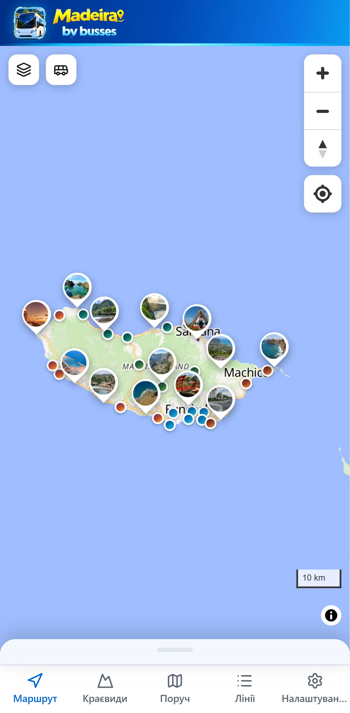 | 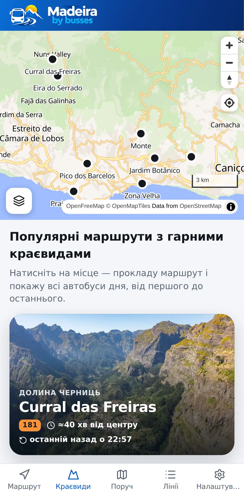 | 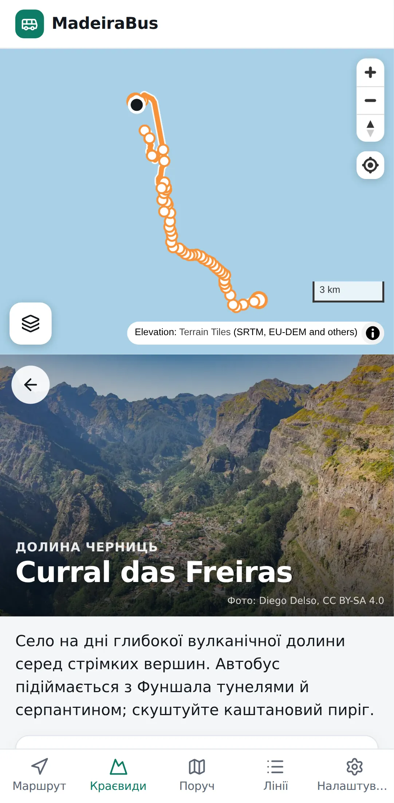 |

| Маршрут і ціна                              | Усі автобуси дня                                             | GPS-супровід: «виходьте на наступній»  |
| ------------------------------------------- | ------------------------------------------------------------ | -------------------------------------- |
| 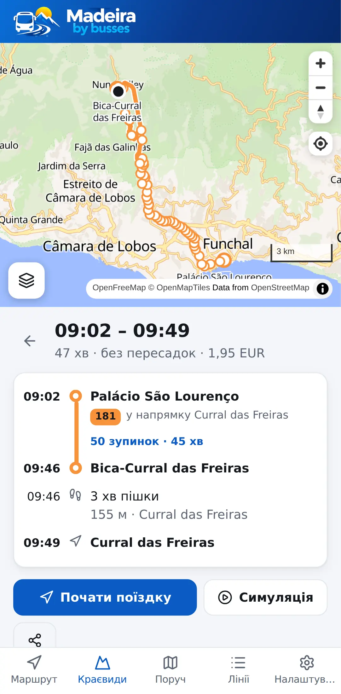 | 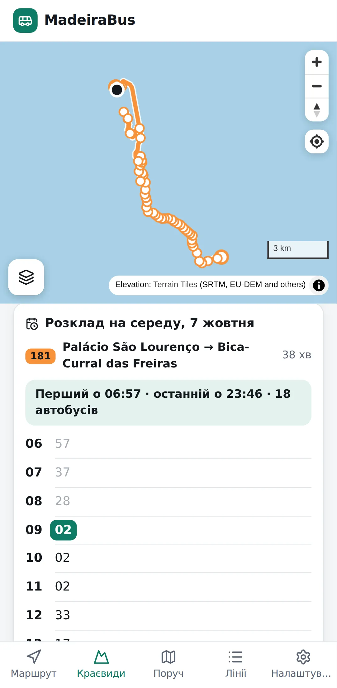 | 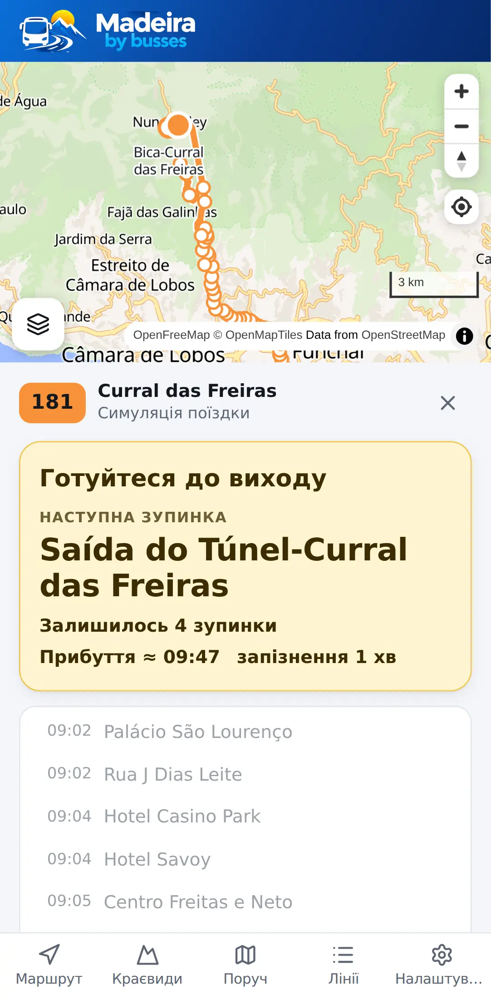 |

| Усі лінії: номери з 2026 року         | Лінія 110: усі рейси й друк              | Розклад для друку (PDF A4)                                      |
| ------------------------------------- | ---------------------------------------- | --------------------------------------------------------------- |
| 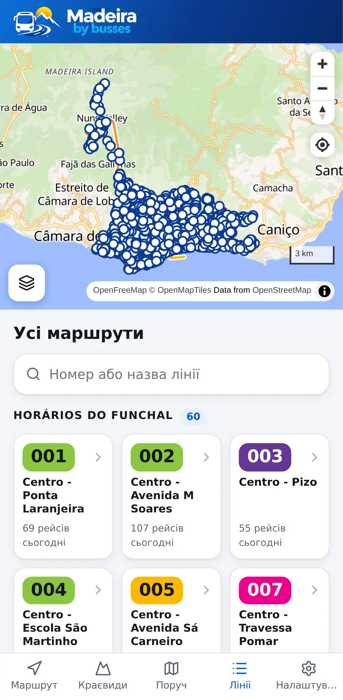 | 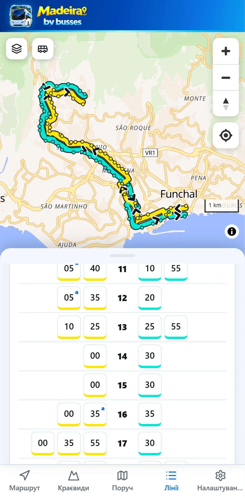 | 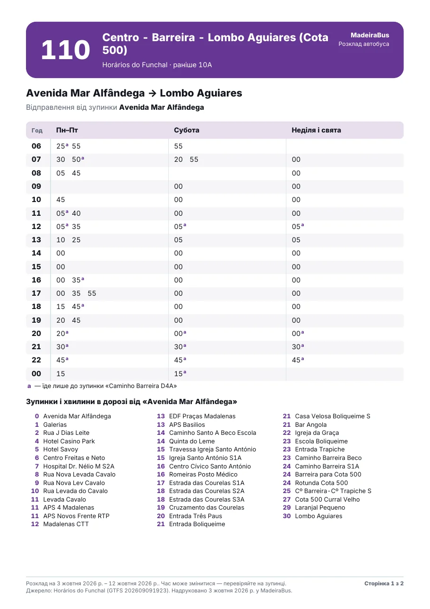 |

Демо-мережа на весь острів і сайт на комп'ютері:

| Маршрути з пересадками                                   | 3D-гори                                       | Сайт на комп'ютері                        |
| -------------------------------------------------------- | --------------------------------------------- | ----------------------------------------- |
| 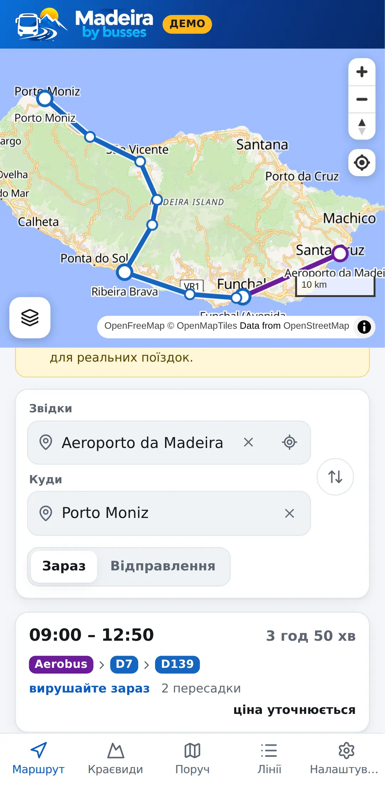 | 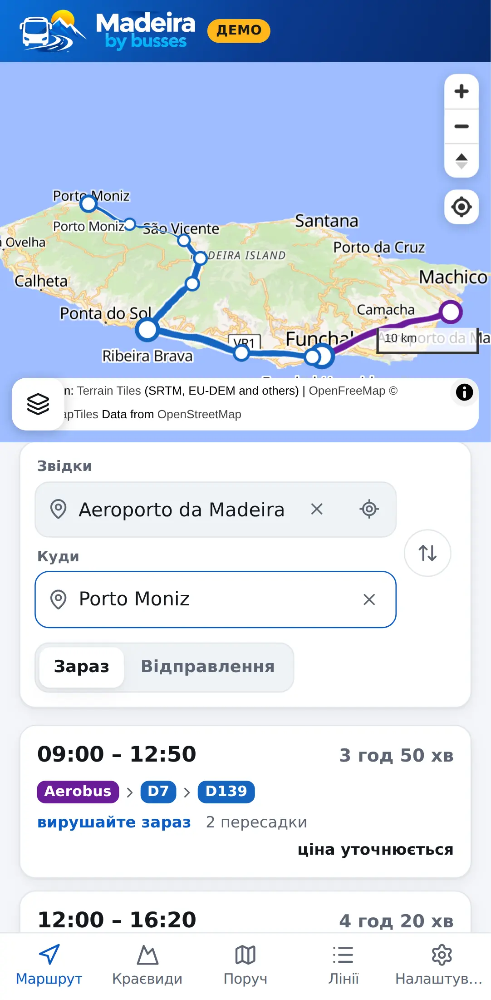 | 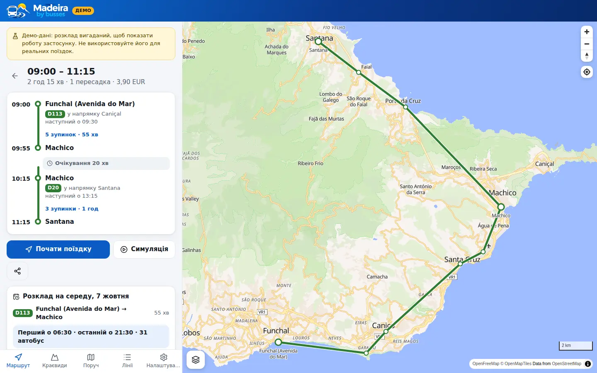 |

## Що вміє

- **Пошук маршруту з пересадками** (алгоритм RAPTOR) прямо на телефоні: до 3 пересадок, піші переходи між зупинками, кілька варіантів відправлення.
  Залишаються лише ті варіанти, що кращі за інші хоча б за одним критерієм: час прибуття, кількість пересадок, час виходу.
- **Очікування на пересадках** і позначка «ризикова пересадка», якщо запас малий, а наступний автобус нескоро.
- **Ціна поїздки** за тарифами SIGA 2026: GIRO чи готівка, муніципальний чи міжмуніципальний тариф.
  **Порадник квитка** порівнює разові квитки з денними й туристичними. Невідому ціну (Aerobus) застосунок не вигадує.
- **Останній автобус назад сьогодні**: для кожного маршруту, бо на півночі острова буває кілька рейсів на день.
- **GPS «коли виходити»**: прив'язка позиції до траси, попередження «готуйтеся» і «виходьте на наступній», вібрація, сповіщення.
  Екран не гасне під час поїздки, а застосунок для Android стежить за поїздкою й попереджає навіть із вимкненим екраном.
  Поїздка не губиться, якщо закрити застосунок чи перезавантажити сторінку, і супровід триває, поки ви дивитеся інші вкладки.
  Окремо продумано:
  - тунелі: коли GPS зникає, застосунок веде позицію за розкладом;
  - запізнення: рахується з GPS без даних перевізника, і застосунок попереджає, якщо пересадку вже не встигнути;
  - екран «показати водієві» з назвою зупинки португальською.
- **Від будь-якого місця до будь-якого:** кафе, готель чи просто точка на карті. Кнопка «Вибрати на карті» біля полів «Звідки» й «Куди» (або торкніться кафе на карті), і застосунок сам вибере найкращу з кількох зупинок поруч.
  Піший шлях рахується реальними вулицями, сходами й доріжками, а не по прямій: «4 хв пішки, 280 м», — і малюється на карті.
  Мережа вулиць острова (6 тис. км з OpenStreetMap) займає 0,7 МБ і працює без інтернету; геопозиція нікуди не надсилається.
- **Пошук місць, а не лише зупинок:** аеропорт, музеї, пляжі, оглядові майданчики, готелі, села — і будь-якою з 10 мов («аеропорт», «Flughafen», «aéroport»). Місця беруться з OpenStreetMap; маршрут прокладається пішки до найзручнішої зупинки.
- **Розклад зупинок і ліній**, відправлення поруч (оновлюються щопівхвилини), свята Мадейри (1 липня, 26 грудня тощо) — за недільним розкладом.
- **Усі лінії** плитками за перевізниками з пошуком за номером чи назвою. Номер — той, що на автобусі з 9 березня 2026 року (110), а старий показано поруч («раніше 10A») і за ним теж можна знайти лінію.
- **Розклад лінії від будь-якої зупинки** на будь-яку дату: усі варіанти, що їдуть у цей бік, перший і останній автобус; рейси, що не доїжджають до кінцевої, позначені літерою («a — лише до Caminho Barreira D4A»).
- **Розклад для друку (PDF A4):** колонки «Пн–Пт», «Субота», «Неділя і свята», зворотний напрямок і хвилини до кожної зупинки, будь-якою з 10 мов. PDF можна завантажити, надрукувати чи надіслати; застосунок для Android відкриває для цього системні «Зберегти як», друк і «Поділитися».
- **Краєвиди:** популярні поїздки з гарними краєвидами (Curral das Freiras, Eira do Serrado, Monte, Ботанічний сад, Pico dos Barcelos…) — фото, опис, маршрут від центру або від вас і всі автобуси дня туди й назад. Місця, куди їздять лише CAM і Rodoeste, з'являться разом із їхніми розкладами.
- **Повний розклад вибраного маршруту:** у деталях поїздки — усі автобуси дня на цій лінії між вашими зупинками (ваш виділено, ті, що вже поїхали, приглушено) і зворотні.
- **Збережені зупинки** (зірочка на зупинці): їхні відправлення першими на вкладці «Поруч» і в порожньому полі пошуку. **Нещодавні поїздки** — на стартовому екрані.
- **Нагадування «час виходити з дому»** за 5 хвилин до виходу (у застосунку для Android).
- **Посилання на маршрут** працюють і після оновлення розкладу: зупинки в них записані за кодами перевізника.
- **Карта з шарами**, як у Google Maps:
  - **Карта** — вулиці, будинки, назви магазинів, лікарень, шкіл, банків, готелів та інших установ (OpenStreetMap);
  - **Супутник** — знімки з тими самими підписами вулиць і установ поверх;
  - **Рельєф** — фізична карта острова з тінями гір.

  Поверх будь-якого шару вмикаються «Місця й установи», «3D-будинки» і «3D-гори».
  Натисніть на установу або поставте шпильку довгим натисканням — і прокладіть маршрут «сюди» чи «звідси».

- **Офлайн-режим (PWA)**: розклад і застосунок кешуються; переглянуті ділянки карти теж.
- **10 мов:** українська, англійська, португальська, іспанська, французька, італійська, німецька, чеська, польська, російська.
  Мова обирається автоматично за мовою телефона чи браузера: українцям — українська, німцям — німецька. Змінити можна в налаштуваннях.
- **Приватність:** геопозиція не залишає телефон.

## Як запустити

Потрібні Node.js 22+ і pnpm 10.

```bash
pnpm install
pnpm dev          # згенерує демо-мережу і запустить застосунок на http://localhost:5173
```

| Команда                                  | Що робить                                                                             |
| ---------------------------------------- | ------------------------------------------------------------------------------------- |
| `pnpm check`                             | лінтер, форматування, перевірка типів, юніт-тести                                     |
| `pnpm build`                             | збірка демо-мережі і production-збірка застосунку в `apps/web/dist`                   |
| `pnpm data`                              | демо-мережа → `apps/web/public/data/demo.json`                                        |
| `pnpm data:real`                         | завантажує офіційний GTFS Horários do Funchal, перевіряє його і збирає `network.json` |
| `pnpm --filter @madeirabus/web e2e`      | браузерні тести (Playwright) на зібраному застосунку                                  |
| `pnpm --filter @madeirabus/mobile build` | збірка сайту для телефона і синхронізація з Android-проєктом (`apps/mobile/android`)  |

## Структура

```
packages/engine    рушій без залежностей: GTFS, компактний пакет мережі, RAPTOR, тарифи, GPS-трекер
packages/pipeline  конвеєр даних: завантаження, перевірка, зведення фідів, звіт, порівняння версій, демо-мережа
apps/web           застосунок: React + Vite + MapLibre, PWA, пошук маршрутів у Web Worker
apps/mobile        застосунок для Android (Capacitor): той самий сайт + GPS із вимкненим екраном, сповіщення, нагадування
docs/              архітектура, дані, план наступних кроків (NEXT.md), скриншоти
branding/          логотип, промо-постер, матеріали для Google Play
scripts/           збирачі джерел розкладу, іконки з логотипа, скриншоти
```

Детальніше:

- [docs/architecture.md](docs/architecture.md) — як влаштовані пошук маршрутів, тарифи і GPS-супровід;
- [docs/data.md](docs/data.md) — звідки беремо дані й що лишилося зробити.

## Якість

- 113 юніт-тестів, зокрема наскрізні сценарії на демо-мережі (фізична можливість маршрутів між усіма 90 парами міст, «аеропорт → Порту-Моніш» із двома пересадками, свята, останній автобус), перенесення розкладу HF і свята, назви зупинок і номери ліній після перенумерації 2026 року, напрямки ліній із короткими рейсами, тиждень на зупинці зі святами, PDF (структура файлу, вбудований шрифт, текст для пошуку), посилання на зупинки за кодами, переклади всіх 10 мов із правильними формами множини.
- 17 браузерних тестів на екрані телефона: пошук і деталі маршруту, симуляція поїздки до «виходьте на наступній» і прибуття, супровід поїздки на інших вкладках, розклад лінії і зміна мови, французька, нещодавні поїздки, збережені зупинки, поїздка після перезавантаження, «назад» зі спільного посилання, шари карти, шпилька як пункт призначення, краєвиди з маршрутом і розкладом на день, пошук лінії й завантаження PDF, справжній розклад HF (лінія 181, лінія 110 «раніше 10A» з її суботнім рейсом о 21:30).
- CI (GitHub Actions) на кожен push; Android-застосунок збирається окремим workflow. Нічна збірка даних не публікує розклад із помилками (`--strict`).

## Розгортання

Застосунок — це статичні файли, тож підійде будь-який хостинг.
Workflow **Deploy website** публікує його на GitHub Pages при кожному push у гілку за замовчуванням і щоночі зі свіжим розкладом. Якщо фід перевізника недоступний, сайт однаково публікується, з останнім збереженим розкладом HF або демо-мережею.
Сайт кладеться в гілку `gh-pages`; якщо Pages ще вимкнено, увімкніть один раз: **Settings → Pages → Build and deployment → Deploy from a branch → `gh-pages`, `/ (root)`** (або Source: GitHub Actions — workflow вміє й так).

### Android

Workflow **Android app** збирає застосунок зі справжнім розкладом при кожній зміні і в гілці за замовчуванням публікує GitHub Release з трьома файлами:

- `Madeira-by-busses.apk` — для встановлення на телефон; посилання `releases/latest/download/Madeira-by-busses.apk` завжди веде на найновішу версію;
- `Madeira-by-busses.aab` — пакет для Google Play;
- `MadeiraBus.apk` — той самий APK під давньою назвою, щоб працювали старі посилання.
  Застосунок сам завантажує свіжий розклад із сайту (раз на 6 годин, коли є інтернет) і переходить на нього при наступному запуску.

APK підписано **публічним тестовим ключем** (`apps/mobile/android/app/madeirabus-public.keystore`): його достатньо, щоб встановлювати й оновлювати застосунок не з Google Play.
Для Google Play чи щоб ніхто інший не міг підписати «оновлення», створіть власний ключ і додайте секрети репозиторію (Settings → Secrets and variables → Actions):
`ANDROID_KEYSTORE_BASE64` (файл ключа в base64), `ANDROID_KEYSTORE_PASSWORD`, `ANDROID_KEY_ALIAS`, `ANDROID_KEY_PASSWORD`. Після переходу на свій ключ стару версію треба один раз видалити.

Локально: `pnpm --filter @madeirabus/mobile build`, потім `apps/mobile/android` в Android Studio або `./gradlew assembleRelease bundleRelease`.

Ідентифікатор застосунку лишився `io.github.nexgenfullstack.madeirabus`: користувачі не бачать його, а з ним нова версія ставиться поверх уже встановленої.

### Логотип та іконки

Логотип — `branding/logo.jpg`, промо-постер — `branding/promo.jpg`.
Усі іконки (сайт, PWA, Android: звичайна, кругла, адаптивна, тематична, заставка) і матеріали для Google Play збирає з логотипа скрипт `python3 scripts/brand-assets.py` (потрібні Pillow і NumPy).
Скриншоти для README і Google Play: `node scripts/screenshots.mjs` на зібраному сайті (`pnpm --filter @madeirabus/web preview`).

Супутникові знімки за замовчуванням беруться з Esri World Imagery (з атрибуцією).
Для комерційного запуску задайте власне джерело у змінних `VITE_SATELLITE_TILES` і `VITE_SATELLITE_ATTRIBUTION`, наприклад MapTiler або Esri з ключем.
