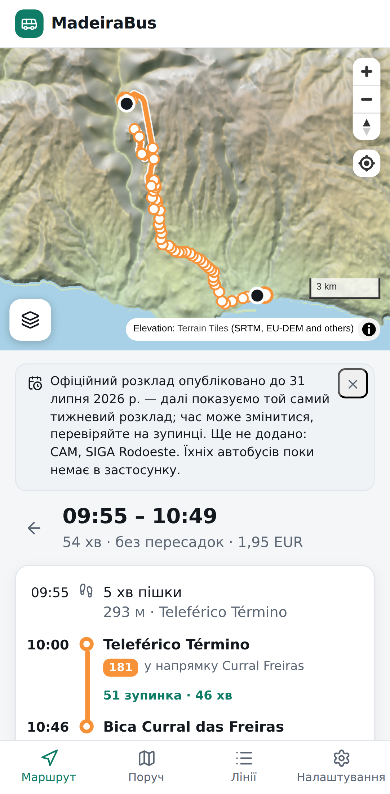
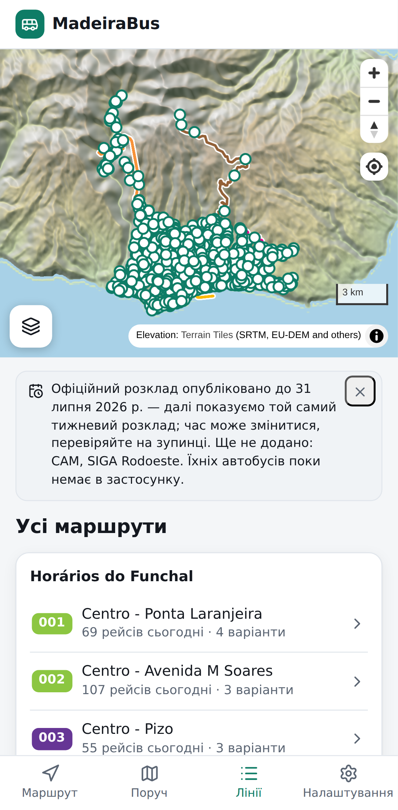
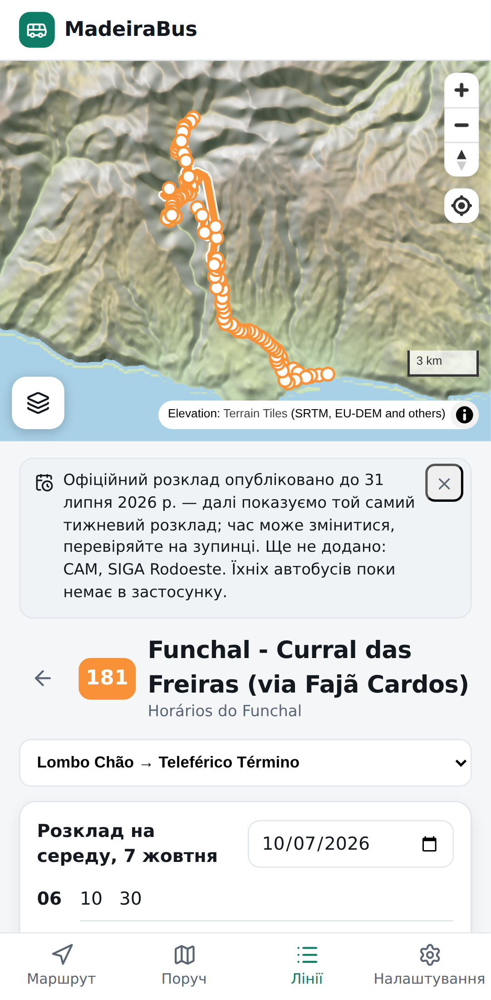
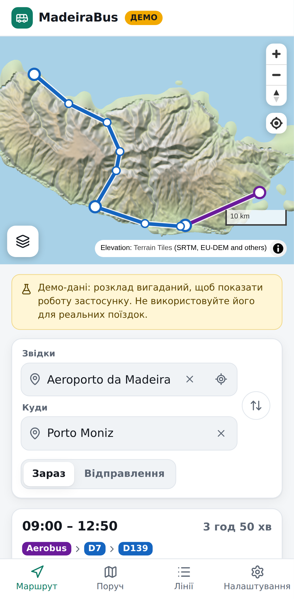
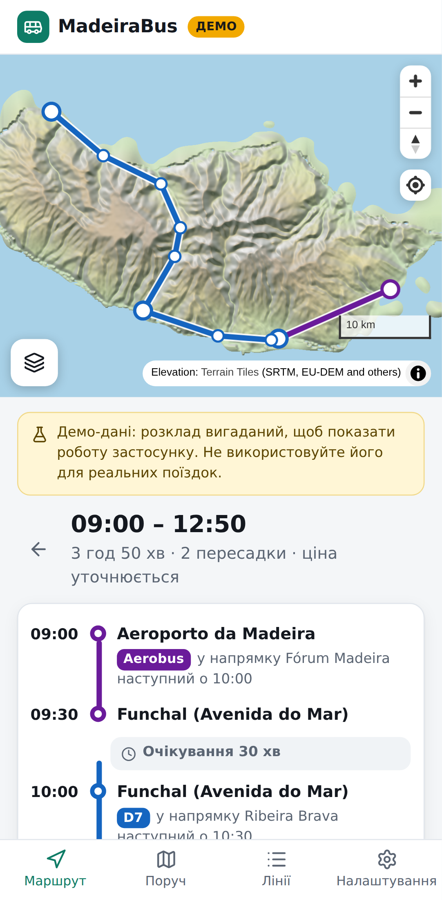
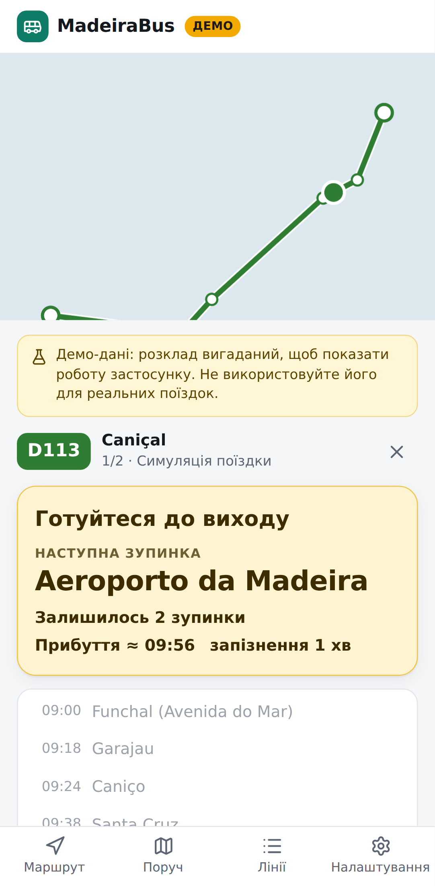
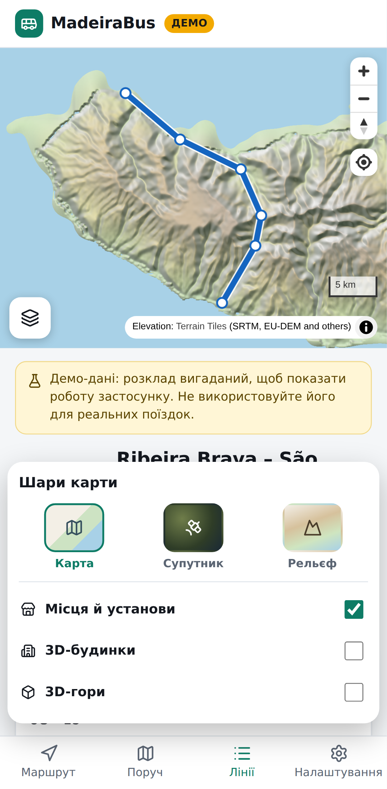
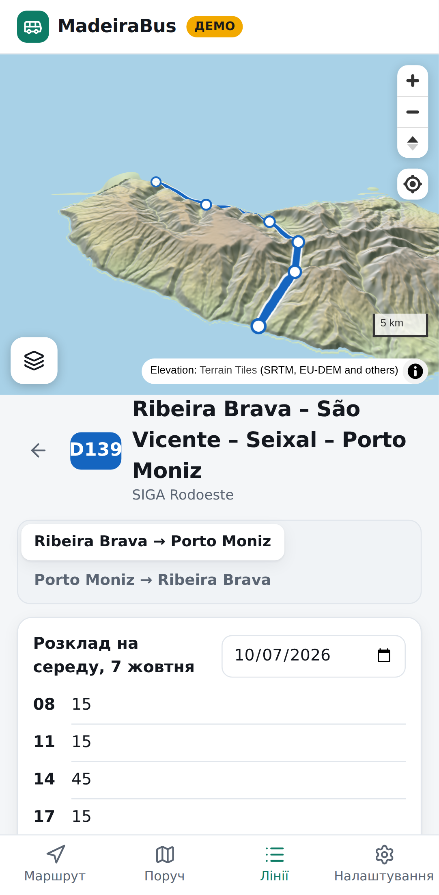
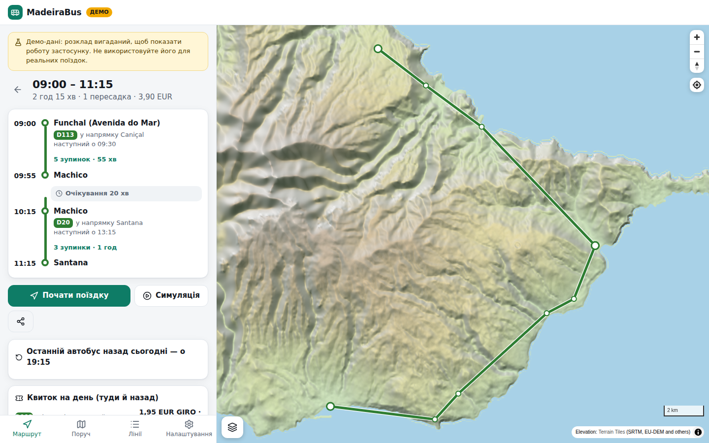

# MadeiraBus

Планувальник поїздок для всієї автобусної мережі Мадейри (SIGA: Horários do Funchal, CAM, SIGA Rodoeste, Aerobus).
Він будує маршрут «від дверей до дверей» з пересадками, показує розклад, очікування й ціну поїздки, а під час поїздки за GPS підказує, коли виходити.
Працює без інтернету.

> **Статус:** працює на **справжньому розкладі Horários do Funchal** (офіційний фід, діє до 30.11.2026): 1 742 зупинки, 60 ліній, 10 656 рейсів. Сайт і застосунок оновлюють дані щоночі.
> Розклади CAM і SIGA Rodoeste — наступний крок (див. [docs/data.md](docs/data.md)). Поки їх немає, застосунок прямо про це каже.
> Для показу всього острова в налаштуваннях є **демо-мережа**: місця справжні, розклад вигаданий, позначена банером «ДЕМО».

**Сайт:** https://nexgen-fullstack.github.io/madeirabus/ (GitHub Pages; як увімкнути — у розділі [Розгортання](#розгортання)).

**Застосунок для Android:** [завантажити MadeiraBus.apk](https://github.com/nexgen-fullstack/madeirabus/releases/latest/download/MadeiraBus.apk) — відкрийте посилання на телефоні, встановіть файл і дозвольте встановлення з цього джерела. Нові версії ставляться поверх старої.
**iPhone:** відкрийте сайт у Safari → «Поділитися» → «На початковий екран».

Справжній розклад Horários do Funchal:

| Центр → Curral das Freiras, лінія 181                     | 61 лінія HF                                  | Лінія 181: напрямки й розклад                |
| --------------------------------------------------------- | -------------------------------------------- | -------------------------------------------- |
|  |  |  |

Демо-мережа на весь острів:

| Маршрут із пересадками                                  | Деталі, ціна, останній автобус назад               | GPS-супровід                                  |
| ------------------------------------------------------- | -------------------------------------------------- | --------------------------------------------- |
|  |  |  |

| Шари карти                                 | 3D-гори                                      | Сайт на комп'ютері                       |
| ------------------------------------------ | -------------------------------------------- | ---------------------------------------- |
|  |  |  |

## Що вміє

- **Пошук маршруту з пересадками** (алгоритм RAPTOR) прямо на телефоні: до 3 пересадок, піші переходи між зупинками, кілька варіантів відправлення.
  Залишаються лише ті варіанти, що кращі за інші хоча б за одним критерієм: час прибуття, кількість пересадок, час виходу.
- **Очікування на пересадках** і позначка «ризикова пересадка», якщо запас малий, а наступний автобус нескоро.
- **Ціна поїздки** за тарифами SIGA 2026: GIRO чи готівка, муніципальний чи міжмуніципальний тариф.
  **Порадник квитка** порівнює разові квитки з денними й туристичними. Невідому ціну (Aerobus) застосунок не вигадує.
- **Останній автобус назад сьогодні**: для кожного маршруту, бо на півночі острова буває кілька рейсів на день.
- **GPS «коли виходити»**: прив'язка позиції до траси, попередження «готуйтеся» і «виходьте на наступній», вібрація, сповіщення.
  Екран не гасне під час поїздки, а застосунок для Android стежить за поїздкою й попереджає навіть із вимкненим екраном.
  Поїздка не губиться, якщо закрити застосунок чи перезавантажити сторінку.
  Окремо продумано:
  - тунелі: коли GPS зникає, застосунок веде позицію за розкладом;
  - запізнення: рахується з GPS без даних перевізника, і застосунок попереджає, якщо пересадку вже не встигнути;
  - екран «показати водієві» з назвою зупинки португальською.
- **Пошук місць, а не лише зупинок:** аеропорт, музеї, пляжі, оглядові майданчики, готелі, села — і будь-якою з 10 мов («аеропорт», «Flughafen», «aéroport»). Місця беруться з OpenStreetMap; маршрут прокладається пішки до найзручнішої зупинки.
- **Розклад зупинок і ліній**, відправлення поруч (оновлюються щопівхвилини), свята Мадейри (1 липня, 26 грудня тощо) — за недільним розкладом.
- **Збережені зупинки** (зірочка на зупинці): їхні відправлення першими на вкладці «Поруч» і в порожньому полі пошуку. **Нещодавні поїздки** — на стартовому екрані.
- **Нагадування «час виходити з дому»** за 5 хвилин до виходу (у застосунку для Android).
- **Посилання на маршрут** працюють і після оновлення розкладу: зупинки в них записані за кодами перевізника.
- **Карта з шарами**, як у Google Maps:
  - **Карта** — вулиці, будинки, назви магазинів, лікарень, шкіл, банків, готелів та інших установ (OpenStreetMap);
  - **Супутник** — знімки з тими самими підписами вулиць і установ поверх;
  - **Рельєф** — фізична карта острова з тінями гір.

  Поверх будь-якого шару вмикаються «Місця й установи», «3D-будинки» і «3D-гори».
  Натисніть на установу або поставте шпильку довгим натисканням — і прокладіть маршрут «сюди» чи «звідси».

- **Офлайн-режим (PWA)**: розклад і застосунок кешуються; переглянуті ділянки карти теж.
- **10 мов:** українська, англійська, португальська, іспанська, французька, італійська, німецька, чеська, польська, російська.
  Мова обирається автоматично за мовою телефона чи браузера: українцям — українська, німцям — німецька. Змінити можна в налаштуваннях.
- **Приватність:** геопозиція не залишає телефон.

## Як запустити

Потрібні Node.js 22+ і pnpm 10.

```bash
pnpm install
pnpm dev          # згенерує демо-мережу і запустить застосунок на http://localhost:5173
```

| Команда                                  | Що робить                                                                             |
| ---------------------------------------- | ------------------------------------------------------------------------------------- |
| `pnpm check`                             | лінтер, форматування, перевірка типів, юніт-тести                                     |
| `pnpm build`                             | збірка демо-мережі і production-збірка застосунку в `apps/web/dist`                   |
| `pnpm data`                              | демо-мережа → `apps/web/public/data/demo.json`                                        |
| `pnpm data:real`                         | завантажує офіційний GTFS Horários do Funchal, перевіряє його і збирає `network.json` |
| `pnpm --filter @madeirabus/web e2e`      | браузерні тести (Playwright) на зібраному застосунку                                  |
| `pnpm --filter @madeirabus/mobile build` | збірка сайту для телефона і синхронізація з Android-проєктом (`apps/mobile/android`)  |

## Структура

```
packages/engine    рушій без залежностей: GTFS, компактний пакет мережі, RAPTOR, тарифи, GPS-трекер
packages/pipeline  конвеєр даних: завантаження, перевірка, зведення фідів, звіт, порівняння версій, демо-мережа
apps/web           застосунок: React + Vite + MapLibre, PWA, пошук маршрутів у Web Worker
apps/mobile        застосунок для Android (Capacitor): той самий сайт + GPS із вимкненим екраном, сповіщення, нагадування
docs/              архітектура, дані, скриншоти
```

Детальніше:

- [docs/architecture.md](docs/architecture.md) — як влаштовані пошук маршрутів, тарифи і GPS-супровід;
- [docs/data.md](docs/data.md) — звідки беремо дані й що лишилося зробити.

## Якість

- 95 юніт-тестів, зокрема наскрізні сценарії на демо-мережі (фізична можливість маршрутів між усіма 90 парами міст, «аеропорт → Порту-Моніш» із двома пересадками, свята, останній автобус), перенесення розкладу HF і свята, назви зупинок, посилання на зупинки за кодами, переклади всіх 10 мов із правильними формами множини.
- 12 браузерних тестів на екрані телефона: пошук і деталі маршруту, симуляція поїздки до «виходьте на наступній» і прибуття, розклад лінії і зміна мови, французька, нещодавні поїздки, збережені зупинки, поїздка після перезавантаження, «назад» зі спільного посилання, шари карти, шпилька як пункт призначення, справжній розклад HF.
- CI (GitHub Actions) на кожен push; Android-застосунок збирається окремим workflow. Нічна збірка даних не публікує розклад із помилками (`--strict`).

## Розгортання

Застосунок — це статичні файли, тож підійде будь-який хостинг.
Workflow **Deploy website** публікує його на GitHub Pages при кожному push у гілку за замовчуванням і щоночі зі свіжим розкладом. Якщо фід перевізника недоступний, сайт однаково публікується, з останнім збереженим розкладом HF або демо-мережею.
Сайт кладеться в гілку `gh-pages`; якщо Pages ще вимкнено, увімкніть один раз: **Settings → Pages → Build and deployment → Deploy from a branch → `gh-pages`, `/ (root)`** (або Source: GitHub Actions — workflow вміє й так).

### Android

Workflow **Android app** збирає APK зі справжнім розкладом при кожній зміні застосунку і в гілці за замовчуванням публікує його як GitHub Release; посилання `releases/latest/download/MadeiraBus.apk` завжди веде на найновішу версію.
Застосунок сам завантажує свіжий розклад із сайту (раз на 6 годин, коли є інтернет) і переходить на нього при наступному запуску.

APK підписано **публічним тестовим ключем** (`apps/mobile/android/app/madeirabus-public.keystore`): його достатньо, щоб встановлювати й оновлювати застосунок не з Google Play.
Для Google Play чи щоб ніхто інший не міг підписати «оновлення», створіть власний ключ і додайте секрети репозиторію (Settings → Secrets and variables → Actions):
`ANDROID_KEYSTORE_BASE64` (файл ключа в base64), `ANDROID_KEYSTORE_PASSWORD`, `ANDROID_KEY_ALIAS`, `ANDROID_KEY_PASSWORD`. Після переходу на свій ключ стару версію треба один раз видалити.

Локально: `pnpm --filter @madeirabus/mobile build`, потім `apps/mobile/android` в Android Studio або `./gradlew assembleRelease`.

Супутникові знімки за замовчуванням беруться з Esri World Imagery (з атрибуцією).
Для комерційного запуску задайте власне джерело у змінних `VITE_SATELLITE_TILES` і `VITE_SATELLITE_ATTRIBUTION`, наприклад MapTiler або Esri з ключем.
