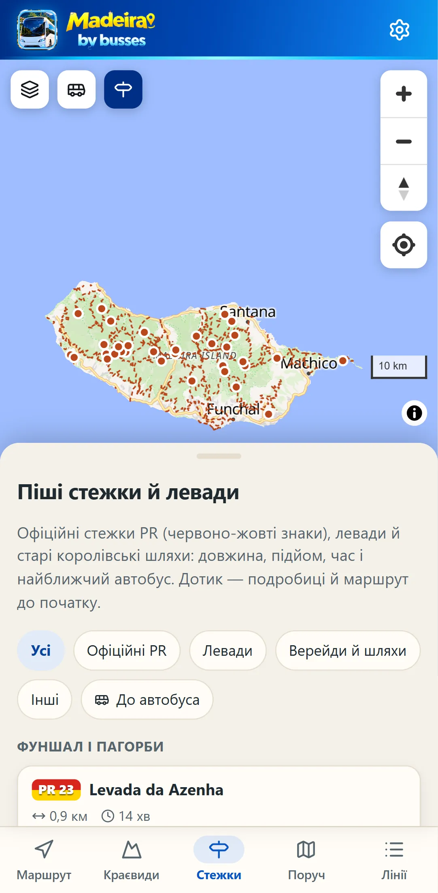
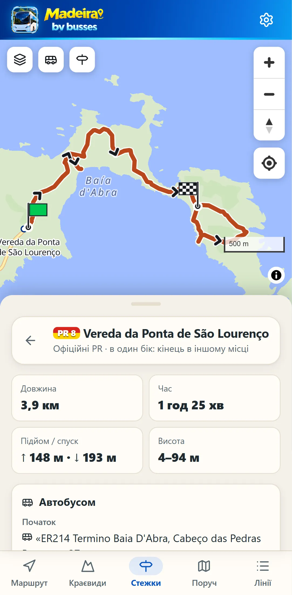
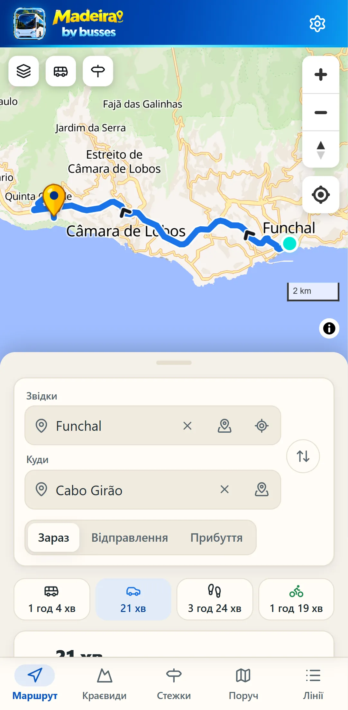

<p align="center"></p>

# Madeira by busses

**Explore Madeira with ease.** Планувальник поїздок автобусами Мадейри (SIGA: Horários do Funchal, CAM, SIGA Rodoeste, Aerobus).
Він будує маршрут «від дверей до дверей» з пересадками, показує розклад, очікування й ціну поїздки, а під час поїздки за GPS підказує, коли виходити.
Працює без інтернету.

> **Статус:** усі автобуси острова на **справжньому розкладі**:
>
> - **Horários do Funchal** — офіційний фід GTFS (діє до 30.11.2026, далі тижневий розклад продовжується): 1 742 зупинки, 60 ліній, 10 656 рейсів;
> - **CAM, SIGA Rodoeste й Aerobus** — усі 160 ліній (53 CAM, 107 Rodoeste), 3 081 рейс з часом на кожній зупинці й календарем на кожен день: їх щоранку забирає збирач із планувальника поїздок, на якому працює сайт SIGA. Свята — за недільним розкладом, будні шкільного року й канікул — за шкільним календарем Мадейри.
>
> Сайт і застосунок оновлюють дані щодня. Лінії на карті йдуть дорогами, якими їде автобус (мережа доріг OpenStreetMap).
> Номери ліній — ті, що на автобусі з 2026 року (**110**, а не старий 10A; **181**, а не 81), старий номер показано поруч.
> **Демо-мережа** (місця справжні, розклад вигаданий, банер «ДЕМО») людям не показується: у налаштуваннях її більше немає, вона лише для тестів і скриншотів (ключ `madeirabus.demo` у браузері) і як запасний варіант, якщо справжнього розкладу в збірці немає.

**Сайт:** https://nexgen-fullstack.github.io/Madeira-by-busses/

**Застосунок для Android:** [завантажити Madeira-by-busses.apk](https://github.com/nexgen-fullstack/Madeira-by-busses/releases/latest/download/Madeira-by-busses.apk) — відкрийте посилання на телефоні, встановіть файл і дозвольте встановлення з цього джерела. Нові версії ставляться поверх старої (і поверх давнього MadeiraBus).
**Для Google Play:** [Madeira-by-busses.aab](https://github.com/nexgen-fullstack/Madeira-by-busses/releases/latest/download/Madeira-by-busses.aab) — пакет для Play Console; іконка, банер, скриншоти й тексти сторінки — у [branding/play](branding/play/README.md).
**iPhone:** відкрийте сайт у Safari → «Поділитися» → «На початковий екран».

| Старт                                | Краєвиди                                  | Curral das Freiras: маршрут і розклад                     |
| ------------------------------------ | ----------------------------------------- | --------------------------------------------------------- |
|  |  |  |

| Маршрут і ціна                              | Усі автобуси дня                                             | GPS-супровід: «виходьте на наступній»  |
| ------------------------------------------- | ------------------------------------------------------------ | -------------------------------------- |
|  |  |  |

| Усі лінії: номери з 2026 року         | Лінія 110: усі рейси й друк              | Розклад для друку (PDF A4)                                      |
| ------------------------------------- | ---------------------------------------- | --------------------------------------------------------------- |
|  |  |  |

| Піші стежки й левади                   | PR 8: прапорці, автобус до початку  | Автобус, авто, пішки чи велосипед      |
| -------------------------------------- | ----------------------------------- | -------------------------------------- |
|  |  |  |

Демо-мережа на весь острів і сайт на комп'ютері:

| Маршрути з пересадками                                   | 3D-гори                                       | Сайт на комп'ютері                        |
| -------------------------------------------------------- | --------------------------------------------- | ----------------------------------------- |
|  |  |  |

## Що вміє

- **Пошук маршруту з пересадками** (алгоритм RAPTOR) прямо на телефоні: до 3 пересадок, піші переходи між зупинками, кілька варіантів відправлення.
  Залишаються лише ті варіанти, що кращі за інші хоча б за одним критерієм: час прибуття, кількість пересадок, час виходу, ходьба.
  Як у Google Maps: перший — **«Найкращий»** з урахуванням усього разом: часу прибуття, пересадок (менше — краще), ціни й ходьби; поруч — шляхи **іншими автобусами** (позначка «Інший автобус»), якщо вони доїжджають не набагато пізніше. Експреси по швидкісній дорозі позначено **«Експрес · Via Rápida»**; якщо такий автобус виїжджає пізніше, а приїжджає раніше або лише на 10–15 хв пізніше за повільний (і в дорозі на 20+ хв менше, без зайвих пересадок, ходьби й доплати), «Найкращим» стає він. Інші картки теж підписано: **«Найшвидший»**, **«Найдешевший»**, **«Менше пішки»**. Якщо в найкращому варіанті довго йти до автобуса чи від нього, окремо шукається варіант, де цей шматок проїжджаєш іншим автобусом. **Пішки всю дорогу** пропонується до 2 км завжди, а до 8 км — коли автобуса немає або пішки не довше (коротка прогулянка до 30 хв може бути й «Найкращою»).
  **Прогулянки з краєвидами** по всьому острову: якщо пішки до 35 хв і здебільшого вздовж моря, набережною чи повз оглядовий майданчик, без крутого підйому й обходу, такий шлях пропонується завжди, стоїть одразу після «Найкращого» з позначкою **«Пішки з краєвидами»**, а коли автобус не швидший (особливо з пересадкою) — сам стає «Найкращим»: безкоштовно й без пересадок. Шлях іде набережною, а не дорогою за нею, якщо це не довше ніж на 30 % (Ribeira Brava → церква Tabua вздовж моря, Marina → Forte de São Tiago по Avenida do Mar, Lido → Doca do Cavacas). На карті він бірюзовий.
  **Піша частина:** до 5 хв пішки до першого автобуса й від останнього — добре; якщо більше, застосунок шукає автобус ближче до дверей (навіть із пересадкою) і ставить його вище, а найдешевший варіант із довгою ходою лишає в списку з позначкою «Найдешевший». Підйоми враховуються: метр угору — як 4 м по рівному, тож 10 хв угору від Bairro do Hospital — це не 10 хв по рівному; на кроці «пішки» — попередження **«Піша хода може бути виснажлива: підйом ~120 м»** (і «крутий спуск», де він великий), на картці — «Підйом ~120 м»; уздовж моря — напис **«Гарні краєвиди по дорозі»**. Висоти — з безкоштовної карти висот (AWS Terrain Tiles, SRTM 30 м), щотижня разом із вулицями.
  Якщо до наступного автобуса довго чекати на пересадці, застосунок знаходить пізніший виїзд на ту саму пересадку.
  **Довше автобусом — менше пішки**, коли це не коштує часу: з зупинок того самого рейсу автобус залишаєш там, звідки найближче до наступного автобуса (чи до мети, якщо там не пізніше), і сідаєш там, куди найближче йти, — 207 довозить до автостанції Ribeira Brava, звідки їде 222, замість 737 м пішки з гори. Лише офіційні зупинки рейсу, без вигаданих продовжень.
  **Пересадка на великій станції**, коли це нічого не коштує: якщо обидва автобуси проходять, наприклад, автостанцію Ribeira Brava, пересадка там, а не на зупинці на горі (200 → 322 до Tabua: з автостанції о 13:40, а не з Boa Morte о 13:34, приїзд той самий). Там багато ліній, тож якщо автобус зламався чи спізнюється, легко сісти на інший. Більшою вважається зупинка з ліній у півтора раза більше (з сусідніми платформами в межах 100 м; автостанція чи термінал — ще +30); за умови, що ходьби не більше ніж на 30 м і запас часу на пересадку не менший (або щонайменше 5 хв). За однакової ходьби — сама автостанція, а не зупинка поруч. Кожне таке покращення маршруту приймається лише тоді, коли не стає пізніше й дорожче.
  Коли так виходить значно швидше, пропонує й довшу прогулянку (до ~40 хв): наприклад, експресом **200 через Via Rápida до Ribeira Brava і пішки до Tabua**.
  Час — «Зараз», «Відправлення о…» або **«Прибуття до…»** (найпізніший вихід, щоб устигнути; «Найкращим» стає значно швидший шлях, що виїжджає трохи раніше: Funchal → Tabua до 20:00 — 200 + 336 о 18:04, у дорозі 65 хв, а не 350 + 221 о 18:17 із 22 хв пішки наприкінці). Варіант, гірший за інший за всім разом — прибуттям, часом у дорозі, пересадками, ціною й ходьбою, — ніколи не буває «Найкращим».
  **Пізно ввечері** не треба перемикати дату: коли сьогодні туди вже нічого не їде, застосунок сам показує перші автобуси наступного дня, коли вони їдуть (завтра, а якщо завтра неділя чи свято без рейсів — далі), і попереджає червоним: «Сьогодні автобусів туди вже немає · Завтра з 05:56», картки з червоним відтінком і позначкою «Завтра» («У понеділок»). Пішки, якщо можна, — як і раніше, просто зараз. День, вибраний вручну, показується як є. Те саме в «Краєвидах», а в картці лінії замість «Сьогодні звідси вже не їде» — «Сьогодні вже не їде · завтра з 07:35».
  **Час, що вже минув, не пропонується:** «Відправлення о 07:00», вибране о 22:40, — це завтра о 07:00, з тим самим червоним попередженням («Цей час сьогодні вже минув · Завтра з 07:14»), і дата сама перемикається на завтра; у вибирачі часу минулі години сьогоднішнього дня неактивні (де телефон це підтримує). У режимі «Прибуття до» автобуси, що вже поїхали, не показуються: якщо зараз уже не встигнути, — той самий час завтра.
  Із самим пунктом призначення маршрут будується від вашого місця, як у картах.
- **Як у Google Maps: автобус, авто, пішки чи велосипед.** Над варіантами — ряд із чотирьох кнопок, на кожній свій час; автобус — головний, як і раніше. **Авто** — дорогами з OpenStreetMap з одностороннім рухом і швидкістю за класом дороги (орієнтовно, без заторів, з паркуванням), синьою лінією; **пішки** — вулицями, сходами й стежками з урахуванням підйомів; **велосипед** — вулицями без сходів і без Via Rápida, підйом рахується важко (гори Мадейри круті), зеленою лінією. Для кожного — відстань, підйом/спуск і кнопка «Навігація в Google Maps». Те саме на сторінці місця в «Як дістатися».
- **Піші стежки** (окрема вкладка «Стежки» і кнопка-вказівник на карті): 116 маршрутів з OpenStreetMap — 39 офіційних стежок PR (номер на червоно-жовтій плашці, як на знаках), левади, верейди й королівські шляхи — за районами й видами, з фільтром «До автобуса». Для кожної — довжина, час за правилом туристів (4 км/год, 300 м/год угору, 500 м/год униз), підйом/спуск і висоти (з висотних тайлів, згладжені вздовж урвищ), кільцева чи в один бік; на карті — зелений прапорець початку й шаховий кінця, найближчі зупинки на обох кінцях з лініями, «Маршрут до початку» / «від кінця» (стежка високо в горах, куди за 1 км від зупинки не дійти, веде від тієї зупинки, звідки найближче саме стежками й вулицями з підйомом, — зі 116 стежок так знайшовся шлях для всіх, крім двох кінців, де стежка в OpenStreetMap не з'єднана з дорогами: Levada de Santana, Vereda da Rocha do Navio), а якщо біля кінця автобуса немає — «назад тим самим шляхом» із часом туди й назад. На карті стежки — пунктиром кольору знаків PR, з номерами біля початків; дотик відкриває стежку.
- **Очікування на пересадках** і позначка «ризикова пересадка», якщо запас малий, а наступний автобус нескоро.
- **Ціна поїздки** за тарифами SIGA 2026: за замовчуванням готівкою в автобусі, у налаштуваннях можна вибрати картку GIRO; муніципальний чи міжмуніципальний тариф.
  **Порадник квитка** порівнює разові квитки з денними й туристичними. Невідому ціну (Aerobus) застосунок не вигадує.
- **Останній автобус назад сьогодні**: для кожного маршруту, бо на півночі острова буває кілька рейсів на день.
- **GPS «коли виходити»**: прив'язка позиції до траси, попередження «готуйтеся» і «виходьте на наступній», вібрація, сповіщення.
  Екран не гасне під час поїздки, а застосунок для Android стежить за поїздкою й попереджає навіть із вимкненим екраном.
  Поїздка не губиться, якщо закрити застосунок чи перезавантажити сторінку, і супровід триває, поки ви дивитеся інші вкладки.
  Окремо продумано:
  - тунелі: коли GPS зникає, застосунок веде позицію за розкладом;
  - запізнення: рахується з GPS без даних перевізника, і застосунок попереджає, якщо пересадку вже не встигнути;
  - екран «показати водієві» з назвою зупинки португальською.
- **Від будь-якого місця до будь-якого:** кафе, готель чи просто точка на карті. Кнопка «Вибрати на карті» біля полів «Звідки» й «Куди» відкриває карту на весь екран із **жовтою шпилькою посередині** (кольору шпильки з логотипа; поки карта рухається, вона бірюзова), як у Google Maps: посуньте карту чи торкніться потрібного місця і натисніть «Вибрати цю точку». Застосунок сам вибере найкращу з кількох зупинок поруч.
  Піший шлях рахується реальними вулицями, сходами й доріжками, а не по прямій: «4 хв пішки, 280 м», — і малюється на карті.
  Мережа вулиць острова (6 тис. км з OpenStreetMap) займає 0,7 МБ і працює без інтернету; геопозиція нікуди не надсилається.
- **Пошук за адресою:** вулиці й номери будинків усієї Мадейри з OpenStreetMap (≈12 500 вулиць, ≈62 000 номерів), без інтернету. Підказки з першої букви, помилки в слові прощаються («Ribera bra» → Ribeira Brava); вибір вулиці підставляє «Вулиця, » і пропонує її номери; немає номера на карті — найближчий з того ж боку вулиці. **Місто чи село** веде туди, де справді зупиняються його автобуси, і лише в його власних межах (парафія чи межі селища з OpenStreetMap): на його автовокзал (Ribeira Brava, Machico, São Vicente); якщо автовокзалу немає — на центральну зупинку (біля центру й з найбільшою кількістю автобусів: Tabua — «Reta Zimbreiros, Tabua», а не автовокзал сусідньої Ribeira Brava); якщо зупинок немає — на головну церкву, раду чи площу; якщо й їх немає — карта показує межі селища, щоб поставити шпильку самому. У списку підказок видно, куди саме: «до автовокзалу», «до зупинки в центрі».
- **Автовокзали:** якщо автобус заїжджає на автовокзал (Ribeira Brava, Machico, São Vicente), висадка й пересадка — там, а не на горі над ним, коли це не довше ніж на 10 хвилин.
- **Пошук місць, а не лише зупинок:** аеропорт, музеї, пляжі, оглядові майданчики, готелі, села — і будь-якою з 10 мов («аеропорт», «Flughafen», «aéroport»). Місця беруться з OpenStreetMap; маршрут прокладається пішки до найзручнішої зупинки.
- **Via Rápida на кожній лінії:** де автобус їде швидкісною дорогою (VR1, VR2 з її з'їздами — з OpenStreetMap), на карті під лінією **фіолетова смуга** з табличками «Via Rápida», на сторінці лінії — «По Via Rápida: Hospital Dr. Nélio → Faja da Ribeira · 14 км» (між якими зупинками й скільки кілометрів), у списку зупинок — фіолетова вставка «VR · По Via Rápida · 14 км» там, де автобус виїжджає на неї; у списку ліній — позначка «VR Via Rápida» (70 ліній з 220), у кроках маршруту й у зупинках рейсу — скільки кілометрів поїздки по ній. Ділянки знаходить щоденна збірка: крок лінії вважається на Via Rápida, коли здебільшого йде вздовж неї (не поперек, по мосту чи під ним) і ніяка інша дорога не ближча; переїзд через розв'язку до 250 м не розриває ділянку, а коротші за 600 м (кільце, з'їзд) не рахуються.
- **Розклад зупинок і ліній**, відправлення поруч (оновлюються щопівхвилини), свята Мадейри (1 липня, 26 грудня тощо) — за недільним розкладом.
- **Усі лінії** плитками за перевізниками з пошуком за номером чи назвою. Номер — той, що на автобусі з 9 березня 2026 року (110), а старий показано поруч («раніше 10A») і за ним теж можна знайти лінію.
- **Розклад лінії від будь-якої зупинки** на будь-яку дату: усі варіанти, що їдуть у цей бік, перший і останній автобус; рейси, що не доїжджають до кінцевої, позначені літерою («a — лише до Caminho Barreira D4A»).
  **Обидва напрямки поруч**, як дві зупинки через дорогу: година посередині, ліворуч хвилини цього напрямку (жовті), праворуч — зворотного (бірюзові) з його зупинки через дорогу, у кожної колонки кінцева. Кожна хвилина — **квадратна кнопка**: дотик відкриває **цей рейс** (його лінія на карті, усі зупинки з часом) з полями «Звідки» (за замовчуванням — ви; без GPS — зупинка посадки) і «Куди» (кінцева рейсу, будь-яка його зупинка прапорцем або точка на карті), кнопкою ⇅ і варіантами, де цей рейс — першим. «Назад» повертає на лінію з тим самим напрямком, зупинкою, днем і прокруткою.
- **Розклад для друку (PDF A4):** колонки «Пн–Пт», «Субота», «Неділя і свята», зворотний напрямок і хвилини до кожної зупинки, будь-якою з 10 мов. PDF можна завантажити, надрукувати чи надіслати; застосунок для Android відкриває для цього системні «Зберегти як», друк і «Поділитися».
- **Розклад картинкою:** на сторінці лінії сама картинка, під нею «Завантажити картинку» й «Надіслати»; у застосунку для Android картинка одразу йде в «Галерею», PDF — у «Завантаження» (папка «Madeira by busses»). Уся лінія на одній картинці PNG, як аркуш SIGA на автостанції: смуга для «Пн–Пт», «Субота», «Неділя і свята», рейси туди поруч із рейсами назад, час на головних зупинках (кінцеві й міста з назви лінії), літера біля рейсу, що їде інакше («через…», «до…»), з поясненням унизу. Картинку можна зберегти в галерею чи надіслати, щоб розклад був під рукою без інтернету.
- **Краєвиди:** 38 найгарніших місць острова за районами — Фуншал і пагорби (Monte, Ботанічний сад, Pico dos Barcelos, Pináculo…), гори (Curral das Freiras, Eira do Serrado, Encumeada, Balcões), захід (Cabo Girão, Ribeira Brava, Ponta do Sol, Calheta, Jardim do Mar, Paul do Mar, маяк Ponta do Pargo, канатна дорога Achadas da Cruz), північ (Porto Moniz, Seixal, Véu da Noiva, São Vicente, Ponta Delgada, Arco de São Jorge, Santana, Guindaste, Porto da Cruz), схід (Portela, Machico, Prainha, Ponta de São Lourenço, Cristo Rei, Caniço de Baixo, Camacha) — з описом 10 мовами, маршрутом звідки завгодно (за замовчуванням — від вас; поля «Звідки» й «Куди» — ті самі, що в плануванні: адреса з номером будинку, зупинка, місце чи шпилька на карті, а кнопка ⇅ між ними повертає маршрут назад; якщо телефон не знає, де ви, або ви не на острові — від центру Фуншала) і всіма автобусами дня туди й назад — одним розкладом по годинах з номером лінії біля кожного часу й справжнім останнім автобусом назад (до місця враховуються його автовокзал і зупинки поруч, у центрі — і термінал Campo da Barca); дотик до номера лінії відкриває її маршрут на карті й розклад. Сторінка місця відкривається фото з назвою й кнопкою «Почати» над нижнім меню, а маршрут туди — на карті над ними; опис, «Як дістатися» й розклад — коли потягнути панель угору. Маленька кнопка **«Почати»** на фото одразу прокладає маршрут від вас і показує його на всю карту; «Назад» повертає у список на те саме місце. Фото є в усіх 38 місць (як додати чи замінити — [docs/data.md](docs/data.md)). **На карті острова**, щойно застосунок відкрився (і на вкладці «Краєвиди»), усі ці місця видно шпильками з круглим фото, кінчик яких стоїть **там, звідки знято фото** (за сторінкою фото у Wikimedia Commons або за самим фото на супутнику; де місце зйомки не визначити — на тому, що на фото): здалека — ті, що не налазять одне на одне, решта — маленькими кольоровими крапками, з наближенням вони розгортаються у фото й підписи; дотик відкриває місце. Нагорі вкладки — **«Прогулянки з краєвидами»**: 14 пішохідних маршрутів уздовж моря до 35 хв по всьому острову з часом, відстанню й підйомом, підсвічені на карті; дотик прокладає маршрут.
- **Повний розклад вибраного маршруту:** у деталях поїздки — усі автобуси дня на цій лінії між вашими зупинками (ваш виділено, ті, що вже поїхали, приглушено) і зворотні, а під кроками поїздки — **розклад кожної лінії картинкою** (200, 336…), як аркуш на автостанції: зупинка, де сідаєте, — жовтою колонкою, ваш автобус — жовтим рядком, з кнопками «Завантажити картинку» й «Поділитися». Той самий блок (`LineSheetBlock`) — у картці лінії на карті й на сторінці лінії.
- **Збережені зупинки** (зірочка на зупинці): їхні відправлення першими на вкладці «Поруч» і в порожньому полі пошуку. **Нещодавні поїздки** — на стартовому екрані.
- **Нагадування «час виходити з дому»** за 5 хвилин до виходу (у застосунку для Android).
- **Посилання на маршрут** працюють і після оновлення розкладу: зупинки в них записані за кодами перевізника.
- **На телефоні карта на весь екран:** застосунок відкривається островом на весь екран між шапкою й меню, над меню — ручка висувної панелі; кожна вкладка — у цій панелі (тягніть за ручку чи торкніться її). Коли вибрано варіант чи почато поїздку, панель сама опускається до ручки, і на всю карту — маршрут і де ви зараз. Повернутий набік телефон показує острів на всю ширину. Кнопка «Назад» телефона повертає крок за кроком до стартового екрана, а там двічі «Назад» — вихід.
- **Карта, як у Google Maps:** відкривається чистим островом. Ліворуч угорі під шапкою — невеликі кнопки: **шари**, **автобус**, що показує всі зупинки й лінії, і **стежки** (ті самі перемикачі є в шарах); праворуч — більші «+ / −», компас і «моє місце». Кнопки, до яких піднялася панель, ховаються, а не лежать на картках; горизонтально вони стають у ряд. Подяки картам — кружечок «i»: текст розкривається лише дотиком і згортається другим дотиком чи дотиком по карті.
  Маршрут малюється **дорогами, якими їде автобус**, **кожен автобус своїм неоновим кольором** (перший жовтий, далі рожевий, бірюзовий, помаранчевий, салатовий) **зі стрілками** в бік руху; де сідаєте — стартовий прапорець, де виходите — шаховий фінішний, як у «Формулі-1»; обидва стоять на тій смузі дороги, якою їде автобус (де виходите з одного й сідаєте в наступний на тій самій зупинці — поруч, трохи окремо, з однією назвою зупинки), і пішохідний шлях (дрібні яскраві точки) веде саме туди; **номер лінії — на лінії в прямокутній плашці її кольору**, як у списку (одразу видно: ця лінія — 045, а ця — 207; плашки не налазять одна на одну й на прапорці й читаються при 3D-нахилі), пункт призначення — жовтою шпилькою.
  **Кожна лінія — по центру своєї смуги** (рух правобічний), хоч як близько наблизити карту: зсув рахується в справжніх метрах для кожного шматка дороги за кількістю й шириною смуг з OpenStreetMap (дорога з двома смугами — пів смуги праворуч від осі, однобічна вулиця з однією смугою — по центру, окремі проїжджі частини Via Rápida — без другого зсуву). **Пішки — по тротуару**, а не посередині дороги: уздовж вулиці, де зупинка, — з її боку, щоб не перетинати дорогу перед автобусом. Траси Horários do Funchal, які перевізник малює вручну поруч із дорогою, «пришиті» до доріг OpenStreetMap так само, як CAM і Rodoeste, тож лінії не йдуть по траві й будинках; щоденна збірка перевіряє кожну трасу (звіт «Lines off the roads»: шматки далі ніж 10 м від дороги). Коли маршрут або лінію вибрано, решта зупинок і ліній острова ховається сама (кнопка автобуса повертає їх, якщо треба). На сторінці лінії вибраний напрямок — **жовтий**, зворотний — **бірюзовий**: де обидва йдуть однією дорогою, це **дві смуги на будь-якому масштабі** з темною суцільною між ними (жовта праворуч у свій бік, бірюзова — по другий бік осі), де розходяться (одностороння вулиця, петля) — кожен посередині своєї вулиці; кружечки зупинок і стрілки — на смузі свого напрямку й свого кольору; ті самі кольори — на кнопках напрямків. Торкніться шпильки — вона стане бірюзовою. Окремі рейси лінії (інша дорога, коротший рейс) видно лише в день, коли вони їдуть, і лише там, де звертають з основної дороги; торкніться такої гілки — з'явиться, у які дні й о котрій вона їде. На близькому масштабі на будинках видно номери, як у Google Maps.
  Торкніться кроку маршруту — карта наблизиться до нього.
  **Торкніться лінії будь-якого автобуса** (на маршруті, на сторінці лінії чи в шарі всіх ліній; до лінії легко влучити пальцем) — відкриється картка: номер у кольорі лінії, напрямок, перевізник, ціна, найближчі відправлення від зупинки й увесь розклад картинкою, як аркуш на автостанції, з цією зупинкою жовтою колонкою (торкніться картинки — вона заповнить екран), з кнопками «Зберегти в галерею», «Поділитися» й «Відкрити лінію повністю». Якщо під пальцем кілька ліній — короткий список, яку відкрити.
  Шари:
  - **Карта** — вулиці, будинки, назви магазинів, лікарень, шкіл, банків, готелів та інших установ (OpenStreetMap), без значків, що лише плутають (урни, інформаційні щити, лавки, питні фонтанчики, вбиральні, спортмайданчики, ворота, скульптури, поштові скриньки, парковки) — на всіх шарах;
  - **Супутник** — знімки з тими самими підписами вулиць і установ поверх;
  - **Рельєф** — фізична карта острова з тінями гір.

  Поверх будь-якого шару вмикаються «Зупинки й лінії автобусів», «Місця й установи», «3D-будинки» і «3D-гори».
  Натисніть на установу або поставте шпильку довгим натисканням — і прокладіть маршрут «сюди» чи «звідси».

- **Офлайн-режим (PWA)**: розклад і застосунок кешуються; переглянуті ділянки карти теж.
- **10 мов:** українська, англійська, португальська, іспанська, французька, італійська, німецька, чеська, польська, російська.
  Мова обирається автоматично за мовою телефона чи браузера: українцям — українська, німцям — німецька. Змінити можна в налаштуваннях.
- **Приватність:** геопозиція не залишає телефон.

## Як запустити

Потрібні Node.js 22+ і pnpm 10.

```bash
pnpm install
pnpm dev          # згенерує демо-мережу і запустить застосунок на http://localhost:5173
```

| Команда                                  | Що робить                                                                             |
| ---------------------------------------- | ------------------------------------------------------------------------------------- |
| `pnpm check`                             | лінтер, форматування, перевірка типів, юніт-тести                                     |
| `pnpm build`                             | збірка демо-мережі і production-збірка застосунку в `apps/web/dist`                   |
| `pnpm data`                              | демо-мережа → `apps/web/public/data/demo.json`                                        |
| `pnpm data:real`                         | завантажує офіційний GTFS Horários do Funchal, перевіряє його і збирає `network.json` |
| `pnpm --filter @madeirabus/web e2e`      | браузерні тести (Playwright) на зібраному застосунку                                  |
| `pnpm --filter @madeirabus/mobile build` | збірка сайту для телефона і синхронізація з Android-проєктом (`apps/mobile/android`)  |

Перевірка трас окремо (та сама, що в звіті збірки): `pnpm --filter @madeirabus/pipeline cli check-shapes --bundle ../../apps/web/public/data/network.json --drive ../../data/sources/osm/drive.bin` — кожен шматок ліній далі ніж 10 м від дороги: лінія, напрямок, між якими зупинками, довжина.

## Структура

```
packages/engine    рушій без залежностей: GTFS, компактний пакет мережі, RAPTOR, тарифи, GPS-трекер
packages/pipeline  конвеєр даних: завантаження, перевірка, зведення фідів, звіт, порівняння версій, демо-мережа
apps/web           застосунок: React + Vite + MapLibre, PWA, пошук маршрутів у Web Worker
apps/mobile        застосунок для Android (Capacitor): той самий сайт + GPS із вимкненим екраном, сповіщення, нагадування
docs/              архітектура, дані, план наступних кроків (NEXT.md), скриншоти
branding/          логотип, промо-постер, матеріали для Google Play
scripts/           збирачі джерел розкладу, іконки з логотипа, скриншоти
```

Детальніше:

- [docs/architecture.md](docs/architecture.md) — як влаштовані пошук маршрутів, тарифи і GPS-супровід;
- [docs/data.md](docs/data.md) — звідки беремо дані й що лишилося зробити.

## Якість

- 275 юніт-тестів, зокрема наскрізні сценарії на демо-мережі (фізична можливість маршрутів між усіма 90 парами міст, «аеропорт → Порту-Моніш» із двома пересадками, свята, останній автобус), шляхи іншими автобусами й «прибуття до», вибір «Найкращого» за пересадками й ціною (і експреса, що приїжджає майже одночасно з повільним автобусом), довша прогулянка від останньої зупинки, календар планувальника SIGA (свята, шкільний і канікулярний розклад, продовження після кінця розкладу), розклад дня з сайту SIGA (який день за який діє, друковані рейси на решту днів, зупинки відрізків, де всі варіанти лінії збігаються), лінії дорогами (односторонні вулиці, зупинки далеко від доріг), перенесення розкладу HF і свята, назви зупинок і номери ліній після перенумерації 2026 року, напрямки ліній із короткими рейсами, тиждень на зупинці зі святами, PDF (структура файлу, вбудований шрифт, текст для пошуку), посилання на зупинки за кодами, переклади всіх 10 мов із правильними формами множини, піші пересадки вулицями (через яр — довкола), підйоми й краєвиди на пішому шляху, прогулянки з краєвидами (і весь список із 14 прогулянок на справжній мережі вулиць), місця «Краєвидів» за районами, ділянки ліній на Via Rápida (не дорога поруч, не міст над нею, не коротке кільце) і їхні смуги на карті (лише під намальованою лінією, не під варіантом поруч), пішки до початку стежки на горі — від зупинки, до якої веде стежка, а не по прямій.
- 28 браузерних тестів на екрані телефона: пошук і деталі маршруту, симуляція поїздки до «виходьте на наступній» і прибуття (лише для тестів: у застосунку кнопки немає), супровід поїздки на інших вкладках, розклад лінії і зміна мови, французька, нещодавні поїздки, збережені зупинки, поїздка після перезавантаження, «назад» зі спільного посилання, шари карти, чистий острів і кнопка зупинок, вибраний маршрут і лінія самі на карті, вибір точки шпилькою, шпилька як пункт призначення, жовта шпилька стає бірюзовою від дотику, краєвиди з маршрутом і розкладом на день, фото місць на карті острова при відкритті (дотик відкриває місце), прогулянки з краєвидами (картка вкладки → «Пішки з краєвидами» першою → «Гарні краєвиди по дорозі»), розклад кожної лінії картинкою під вибраним маршрутом, пошук лінії й завантаження PDF, справжній розклад HF (лінія 181, лінія 110 «раніше 10A» з її суботнім рейсом о 21:30).
- CI (GitHub Actions) на кожен push; Android-застосунок збирається окремим workflow. Нічна збірка даних не публікує розклад із помилками (`--strict`).

## Розгортання

Застосунок — це статичні файли, тож підійде будь-який хостинг.
Workflow **Deploy website** публікує його на GitHub Pages при кожному push у гілку за замовчуванням і щоночі зі свіжим розкладом. Якщо фід перевізника недоступний, сайт однаково публікується, з останнім збереженим розкладом HF або демо-мережею.
Сайт кладеться в гілку `gh-pages`; якщо Pages ще вимкнено, увімкніть один раз: **Settings → Pages → Build and deployment → Deploy from a branch → `gh-pages`, `/ (root)`** (або Source: GitHub Actions — workflow вміє й так).

### Android

Workflow **Android app** збирає застосунок зі справжнім розкладом при кожній зміні і в гілці за замовчуванням публікує GitHub Release з трьома файлами:

- `Madeira-by-busses.apk` — для встановлення на телефон; посилання `releases/latest/download/Madeira-by-busses.apk` завжди веде на найновішу версію;
- `Madeira-by-busses.aab` — пакет для Google Play;
- `MadeiraBus.apk` — той самий APK під давньою назвою, щоб працювали старі посилання.
  Застосунок сам завантажує свіжий розклад із сайту (раз на 6 годин, коли є інтернет) і переходить на нього при наступному запуску.

APK підписано **публічним тестовим ключем** (`apps/mobile/android/app/madeirabus-public.keystore`): його достатньо, щоб встановлювати й оновлювати застосунок не з Google Play.
Для Google Play чи щоб ніхто інший не міг підписати «оновлення», створіть власний ключ і додайте секрети репозиторію (Settings → Secrets and variables → Actions):
`ANDROID_KEYSTORE_BASE64` (файл ключа в base64), `ANDROID_KEYSTORE_PASSWORD`, `ANDROID_KEY_ALIAS`, `ANDROID_KEY_PASSWORD`. Після переходу на свій ключ стару версію треба один раз видалити.

Налаштування — шестерня праворуч у шапці (у нижньому меню — Маршрут, Краєвиди, Стежки, Поруч, Лінії). Палітра — кольори острова довкола кольорів логотипа: теплий пісочний фон під картками, графітовий текст, глибокий атлантичний синій для вибраного (темна тема — теж). Автори фото й ліцензії — у «Налаштуваннях» → «Фотографії» (розділ згорнутий, розкривається дотиком; так само «Джерела» розкладу). Номер версії (`1.0.<номер збірки>`) застосунок показує в «Налаштуваннях» → «Про застосунок»: так видно, чи на телефоні найновіша.

Локально: `pnpm --filter @madeirabus/mobile build`, потім `apps/mobile/android` в Android Studio або `./gradlew assembleRelease bundleRelease`.

Ідентифікатор застосунку лишився `io.github.nexgenfullstack.madeirabus`: користувачі не бачать його, а з ним нова версія ставиться поверх уже встановленої.

### Логотип та іконки

Логотип — `branding/logo.webp`, промо-постер — `branding/promo.jpg`. Кольори застосунку взято з логотипа: темно-синій дороги, блакитне сяйво, жовтий «Madeira» і його шпильки, бірюзова хвиля (`apps/web/src/styles.css`, Android — `values/colors.xml`).
Усі іконки (сайт, PWA, Android: звичайна, кругла, адаптивна, тематична, заставка) і матеріали для Google Play збирає з логотипа скрипт `python scripts/brand-assets.py` (потрібні Pillow і NumPy): знаходить світлу рамку плитки, вирізає плитку зі сяйва, а для шапки застосунку — напис «Madeira by busses» і автобус. Іконка на телефоні й у Google Play — картинка на всю кнопку, обідок плитки лише тонкою рамкою по краю (`full_bleed`), без синього сяйва навколо; напис поміщається і в кругло обрізану іконку. Після системної заставки Android застосунок показує власний екран запуску з великим логотипом (`launch-logo.webp`, розмітка в `apps/web/index.html`) на кольорі заставки, доки не намалюється карта (0,8–2,5 с); на сайті в браузері його немає.
Скриншоти для README і Google Play: `node scripts/screenshots.mjs` на зібраному сайті (`pnpm --filter @madeirabus/web preview`).

Супутникові знімки за замовчуванням беруться з Esri World Imagery (з атрибуцією).
Для комерційного запуску задайте власне джерело у змінних `VITE_SATELLITE_TILES` і `VITE_SATELLITE_ATTRIBUTION`, наприклад MapTiler або Esri з ключем.
